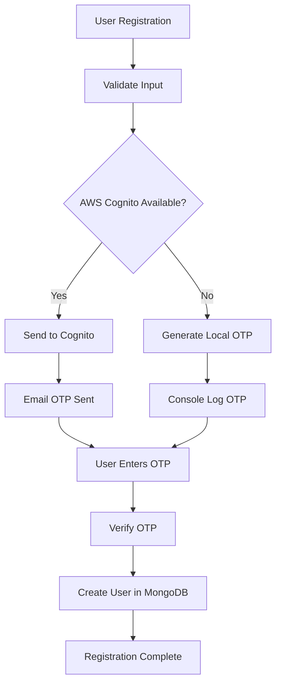
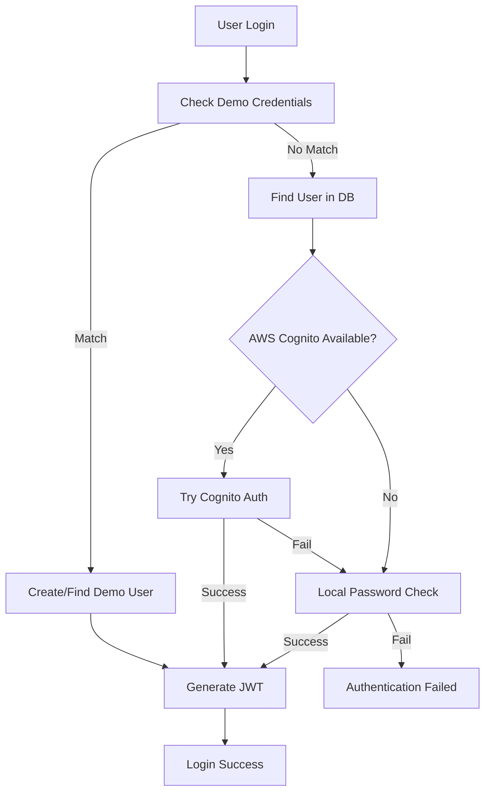

# 🔐 GreenSphere Authentication System

A robust, production-ready authentication system with AWS Cognito integration and local fallback.

## 🌟 Features

### ✅ **Secure Authentication**
- AWS Cognito integration for production
- Local authentication fallback for development
- Bcrypt password hashing
- JWT token-based sessions
- Email verification with OTP

### ✅ **User Management**
- Multi-role support (Student, Teacher, Admin)
- Teacher approval workflow
- Profile management
- Password reset functionality

### ✅ **Developer Experience**
- Demo accounts for quick testing
- Comprehensive error handling
- Development mode OTP logging
- Automated testing scripts

## 🚀 Quick Start

### 1. **Demo Login (Instant Access)**

Use these credentials for immediate testing:

```bash
# Student Demo
Email: student@demo.com
Password: demo123

# Teacher Demo  
Email: teacher@demo.com
Password: demo123

# Admin Demo
Email: admin@demo.com
Password: demo123
```

### 2. **Register New Account**

1. Go to `/register`
2. Fill in your details
3. Check console logs for OTP (development mode)
4. Verify with 6-digit code
5. Login with your credentials

### 3. **Production Setup**

Follow the [AWS Cognito Setup Guide](./AWS_COGNITO_SETUP.md) for production deployment.

## 🔧 Configuration

### Environment Variables

**Server (.env)**
```env
# Required
MONGODB_URI=mongodb://localhost:27017/greensphere
JWT_SECRET=your-super-secret-jwt-key
PORT=9000

# AWS Cognito (Optional - for production)
AWS_REGION=us-east-1
COGNITO_USER_POOL_ID=us-east-1_xxxxxxxxx
COGNITO_CLIENT_ID=xxxxxxxxxxxxxxxxxxxxxxxxxx
AWS_ACCESS_KEY_ID=your_access_key_id
AWS_SECRET_ACCESS_KEY=your_secret_access_key
```

**Client (.env)**
```env
# Required
REACT_APP_API_URL=http://localhost:9000/api

# AWS Cognito (Optional)
REACT_APP_AWS_REGION=us-east-1
REACT_APP_COGNITO_USER_POOL_ID=us-east-1_xxxxxxxxx
REACT_APP_COGNITO_CLIENT_ID=xxxxxxxxxxxxxxxxxxxxxxxxxx
```

## 🔄 Authentication Flow

### Registration Flow



### Login Flow



## 🧪 Testing

### Automated Testing

```bash
# Run authentication tests
cd server
npm run test-auth

# Follow the interactive prompts to test:
# 1. Full Registration + Login Flow
# 2. Login Only
# 3. Demo Account Login  
# 4. All Tests
```

### Manual Testing

1. **Registration Test**
   ```bash
   curl -X POST http://localhost:9000/api/auth/register \
     -H "Content-Type: application/json" \
     -d '{
       "email": "test@example.com",
       "name": "Test User",
       "password": "TestPass123!",
       "role": "student"
     }'
   ```

2. **OTP Verification**
   ```bash
   curl -X POST http://localhost:9000/api/auth/verify-signup-otp \
     -H "Content-Type: application/json" \
     -d '{
       "email": "test@example.com",
       "otp": "123456",
       "role": "student"
     }'
   ```

3. **Login Test**
   ```bash
   curl -X POST http://localhost:9000/api/auth/login \
     -H "Content-Type: application/json" \
     -d '{
       "email": "test@example.com",
       "password": "TestPass123!"
     }'
   ```

## 🛡️ Security Features

### Password Requirements
- Minimum 8 characters
- Must contain uppercase and lowercase letters
- Must contain numbers
- Must contain special characters (for Cognito)

### Token Security
- JWT tokens with 7-day expiration
- Secure token storage in localStorage
- Automatic token refresh on API calls
- Token validation on protected routes

### Data Protection
- Bcrypt password hashing (cost factor: 12)
- Email normalization (lowercase, trimmed)
- Input validation and sanitization
- SQL injection prevention with Mongoose

## 🔍 Troubleshooting

### Common Issues

1. **"Invalid email or password"**
   - Check credentials are correct
   - Verify user exists in database
   - Check password meets requirements

2. **"OTP verification failed"**
   - Check OTP is 6 digits
   - Verify OTP hasn't expired (5 minutes)
   - Check console logs in development mode

3. **"AWS Cognito errors"**
   - Verify environment variables are set
   - Check AWS credentials and permissions
   - Ensure User Pool and App Client are configured

4. **"Token verification failed"**
   - Check token format and expiration
   - Verify JWT secret matches
   - Clear localStorage and re-login

### Debug Mode

Enable detailed logging:

```env
DEBUG=true
NODE_ENV=development
```

### Error Codes

| Code | Description | Solution |
|------|-------------|----------|
| `UserExists` | Email already registered | Use different email or login |
| `WeakPassword` | Password doesn't meet requirements | Use stronger password |
| `InvalidOTP` | Wrong verification code | Check email or console logs |
| `OTPExpired` | Verification code expired | Request new registration |
| `UserNotFound` | User doesn't exist | Register first or check email |

## 📚 API Reference

### Authentication Endpoints

#### POST `/auth/register`
Register a new user and send OTP.

**Request:**
```json
{
  "email": "user@example.com",
  "name": "Full Name",
  "password": "SecurePass123!",
  "role": "student"
}
```

**Response:**
```json
{
  "message": "Verification code sent to your email",
  "userSub": "user-id"
}
```

#### POST `/auth/verify-signup-otp`
Verify OTP and complete registration.

**Request:**
```json
{
  "email": "user@example.com",
  "otp": "123456",
  "role": "student"
}
```

**Response:**
```json
{
  "message": "Registration completed successfully!",
  "userId": "user-id"
}
```

#### POST `/auth/login`
Authenticate user and get JWT token.

**Request:**
```json
{
  "email": "user@example.com",
  "password": "SecurePass123!"
}
```

**Response:**
```json
{
  "token": "jwt-token",
  "user": {
    "id": "user-id",
    "email": "user@example.com",
    "name": "Full Name",
    "role": "student",
    "points": 0,
    "level": "Seedling"
  }
}
```

#### GET `/auth/verify`
Verify JWT token and get user info.

**Headers:**
```
Authorization: Bearer jwt-token
```

**Response:**
```json
{
  "user": {
    "id": "user-id",
    "email": "user@example.com",
    "name": "Full Name",
    "role": "student"
  }
}
```

## 🚀 Production Deployment

### 1. **AWS Cognito Setup**
- Follow [AWS Cognito Setup Guide](./AWS_COGNITO_SETUP.md)
- Configure production User Pool
- Set up proper IAM permissions

### 2. **Environment Configuration**
- Set production environment variables
- Use strong JWT secrets
- Configure HTTPS
- Set up proper CORS

### 3. **Security Checklist**
- [ ] AWS Cognito configured
- [ ] Strong JWT secret (32+ characters)
- [ ] HTTPS enabled
- [ ] CORS properly configured
- [ ] Rate limiting implemented
- [ ] Input validation enabled
- [ ] Error logging configured

## 🆘 Support

### Getting Help

1. **Check the logs** - Most issues are logged with detailed error messages
2. **Run the test script** - `npm run test-auth` to verify setup
3. **Check environment variables** - Ensure all required vars are set
4. **Review the guides** - AWS Cognito and Authentication guides
5. **Demo accounts** - Use demo credentials to verify basic functionality

### Contact

For additional support:
- Check the [GitHub Issues](https://github.com/yourusername/GreenSphere/issues)
- Review the [Documentation](../README.md)
- Contact the development team

---

**🌍 GreenSphere Authentication System - Secure, Scalable, Simple**